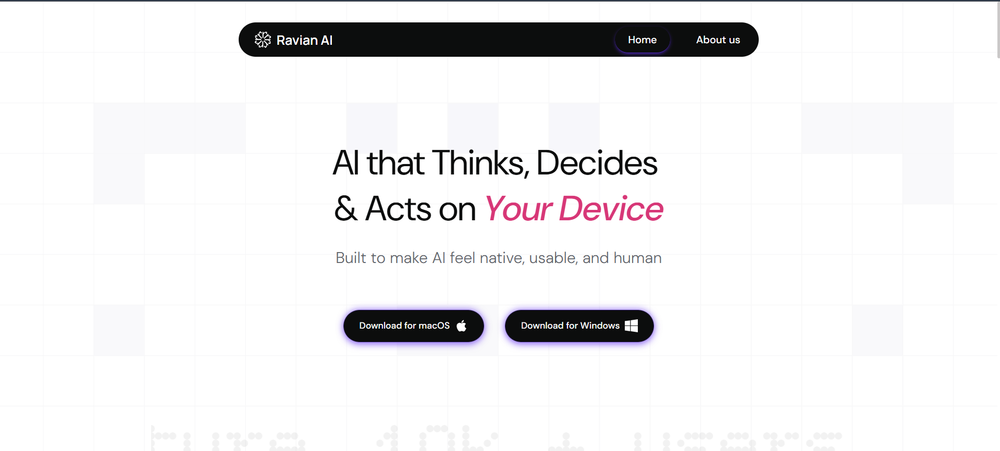
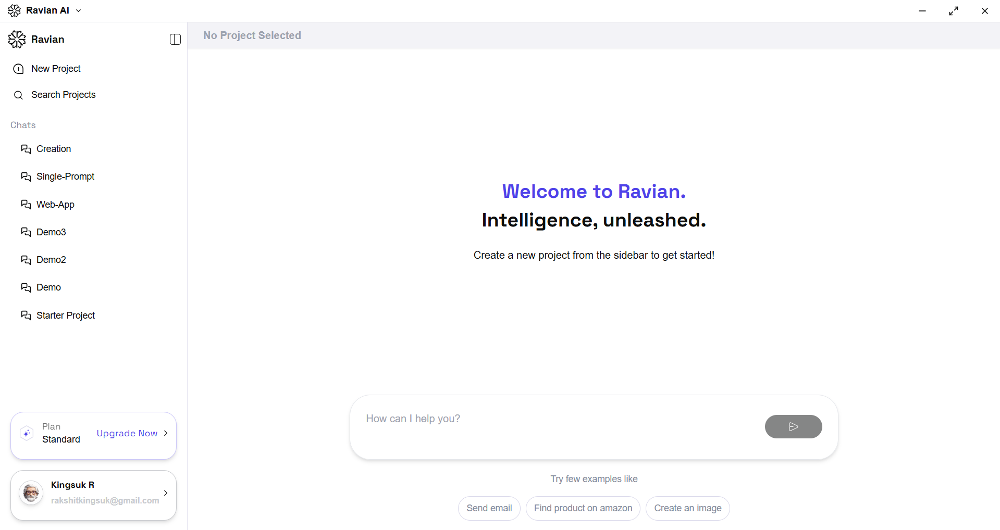

# Quick Start

This guide walks you from downloading Ravian AI to running your first autonomous workflow in just a few minutes.

It is designed to help you verify that Ravian is installed correctly and capable of planning and executing an end-to-end task on your device using its Large Action Model engine.

---

## Download Ravian AI

Download the Ravian desktop application from the official website:

[Ravian AI](https://www.ravian.ai)

Ravian is available for both Windows and macOS. Platform-specific installers are provided on the homepage.

{ alt="Ravian AI website showing Download for macOS and Download for Windows buttons" }

---

## Before you begin

Before installing Ravian, ensure that your environment meets the following conditions:

- A desktop system with active internet connectivity for web-based tasks  
- Permission to install and run applications on your machine  
- Access to the applications you want Ravian to operate, such as a web browser, email client, or office tools  

!!! note
    Ravian runs locally on your device. This allows it to interact with local files and applications while keeping sensitive data under your control.

---

## Launch Ravian AI

Install Ravian using the downloaded installer for your operating system.

Once installation is complete, open Ravian from your applications menu or taskbar shortcut. During startup, Ravian initializes its local runtime and prepares the execution environment.

When the welcome screen appears, the agent is ready to accept tasks.

{ alt="Ravian AI desktop application showing sidebar with projects and welcome message in the main panel" }

---


## Create your first task

To begin, you will run a simple but representative workflow: researching a topic and generating a written summary.

In the main input field, enter a goal such as:

```text title="Prompt"
Research the current state of Large Action Models and generate a 2-page summary for a non-technical audience.
```
Submit the instruction by pressing **Enter** or clicking the run button.

Ravian interprets the goal, decomposes it into a multi-step plan, and prepares the actions required to achieve the outcome.

!!! Tip
    Frame instructions in terms of outcomes rather than individual actions.
    For example, prefer **“Create a market landscape deck for Indian fintech lenders”** over **“Search for fintech reports.”**

---

## Review and approve the plan

Before execution begins, Ravian presents the proposed plan for review.

This plan typically includes steps such as:

* Identifying sources
* Extracting relevant information
* Synthesizing content
* Formatting the final output

Review the steps carefully and adjust the goal, constraints, or tone if needed.
When ready, approve the plan to allow Ravian to proceed.

!!! Warning
    If the plan involves sending emails, accessing private data, or interacting with sensitive systems, verify the scope and recipients before approval.

---

## Observe execution

After approval, Ravian executes the workflow autonomously using its Large Action Model.

During execution, you can monitor progress in real time.
The interface displays:

* Which applications, pages, or files are being accessed
* Intermediate results such as extracted notes or draft sections

Execution can be paused or stopped at any time if intervention is required.

!!! Note
    Ravian continuously validates intermediate results and may adapt its plan to better align with the intended goal.

---

## Review the result

When execution completes, Ravian presents the final output along with any generated files.

For the research example, this may include:

* A structured document with clearly defined sections
* A saved file in your workspace

From the results view, you can open the output in your preferred editor, ask follow-up questions, or convert the result into a new task, such as transforming the summary into a presentation.

---

## Next steps

You have now confirmed that Ravian can:

* Interpret a goal
* Plan a multi-step workflow
* Execute it autonomously on your device

To continue:

* Refer to **Installation** for detailed system requirements and configuration options
* Follow **First Task** to automate a more advanced workflow
* Explore **Core Capabilities** to understand how Ravian handles research, data analysis, presentations, automation, integrations, and multimodal tasks


